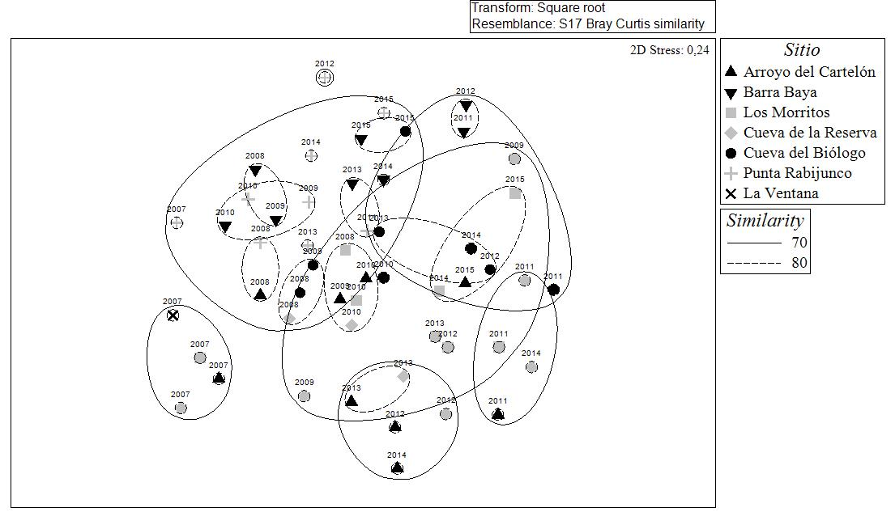
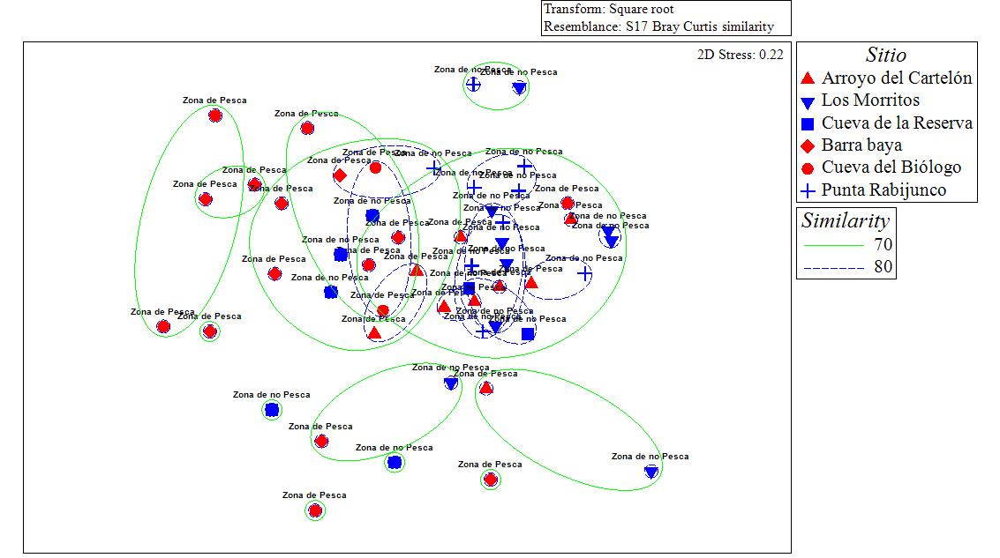

```{r setup, include=FALSE}
knitr::opts_chunk$set(echo = F, fig.height = 3, warning = F, message = F)
```

```{r cargar paquetes}

suppressPackageStartupMessages({
  library(ggplot2)
  library(dplyr)
  library(tidyr)
  library(MPAtools)
  library(reshape)
  library(stargazer)
  library(ggExtra)
})

```

```{r cargar datos}

# abnt <- read.csv("./Datos/12082016 ISPM Especifico.csv", sep = ";", stringsAsFactors = F) %>%
#   mutate(NT = as.numeric(NT), a = as.numeric(a), b=as.numeric(b))
# 
# datos <- read.csv("./Datos/peces_completado.csv", sep=";")%>%
#   filter (!GeneroEspecie == "Urobatis spp.") %>%
#   mutate(id = paste(Dia, Mes, Ano, Sitio, Transecto))
# 
# datos2 <- datos %>%
#   select(id, Genero, Especie, GeneroEspecie, Talla, Abundancia) %>%
#   complete(id, nesting(Genero, Especie, GeneroEspecie), fill = list(Talla = NA, Abundancia = 0))
# 
# datos <- datos %>%
#   select(-GeneroEspecie, -Talla, -Abundancia, -Genero, -Especie) %>%
#   group_by(id, Dia, Mes, Ano, Estado, Comunidad, Sitio, Latitud, Longitud, Habitat, Zonificacion, TipoProteccion, ANP, BuzoMonitor, HoraInicial, HoraFinal, ProfundidadInicial, ProfundidadFinal, Temperatura, Visibilidad, Corriente, Transecto) %>%
#   summarize(N=n()) %>%
#   select(-N) %>%
#   full_join(datos2, by ="id") %>%
#   left_join(abnt, by = "GeneroEspecie") %>%
#   mutate(Talla = as.numeric(as.character(Talla)), Abundancia = as.numeric(as.character(Abundancia))) %>%
#   mutate(Biomasa = Abundancia*a*(Talla^b)) %>%
#   mutate(TransectNumber = Transecto, Site = Comunidad, Year = Ano, Zone = Zonificacion, SizeClass = Talla) %>%
#   filter(!is.na(Abundancia)) %>%
#   ungroup()

# datos <- read.csv("./Datos/limpios/pecesISPM_JCVD16082016.csv", sep=";") %>%
#   filter(!GeneroEspecie == "Urobatis sp.") %>%
#   filter(!GeneroEspecie == "Kiphosus sp.") %>%
#   filter(!GeneroEspecie == "Muraena sp.")

load("Peces.Rdata")

datos <- datos %>%
  mutate(TL = NT)

```

\clearpage

# Peces

## Estructura comunitaria



\clearpage

## Densidad promedio por zona

```{r}

N <- density(datos, "Bahia de Kino")
mpa_plot2(N, "d")

```

```{r, results = 'asis'}

NP <- N %>%
  group_by(Ano, Zonificacion) %>%
  summarize(N = mean (D)) %>%
  filter(Zonificacion == "Zona de Pesca ")
modelNP <- lm(N ~ Ano, data = NP)

NR <- N %>%
  group_by(Ano, Zonificacion) %>%
  summarize(N = mean (D)) %>%
  filter(Zonificacion == "Zona de no Pesca ")
modelNR <- lm(N ~ Ano, data = NR)

N2 <- datos %>%
  mutate(Temperatura = as.numeric(as.character(Temperatura))) %>%
  group_by(Ano, Zonificacion, Sitio, Transecto) %>%
  summarize(N = sum(Abundancia, na.rm=T), Temp = mean(Temperatura, na.rm = T)) %>%
  group_by(Ano, Zonificacion) %>%
  summarize(N = mean(N, na.rm=T), Temp = mean(Temp, na.rm=T))

modelNT <- lm(N ~ Ano + Temp, data = N2)

stargazer(modelNP, modelNR, modelNT, type = "latex", dep.var.caption = "Densidad (orgs / transecto)", omit.stat = c("n"), title = "Modelos lineales describiendo cambios en las densidades promedio por zona.", column.labels = c("Pesca", "Reserva"), covariate.labels = c("Año", "Zonificacion", "Temperatura"), report = "vct*", single.row = TRUE)

```

## Riqueza promedio por zona

```{r}

S <- richness(data = datos, location = "Bahia de Kino")
mpa_plot2(S, "s")

```

```{r, results = 'asis'}

 SP <- S %>%
  group_by(Ano, Zonificacion) %>%
  summarize(S = mean(S)) %>%
  filter(Zonificacion == "Zona de Pesca ")
modelSP <- lm(S ~ Ano, data = SP)

 SR <- S%>%
  group_by(Ano, Zonificacion) %>%
  summarize(S = mean(S)) %>%
  filter(Zonificacion == "Zona de no Pesca ")
modelSR <- lm(S ~ Ano, data = SR)


stargazer(modelSP, modelSR, type = "latex", dep.var.caption = "Riqueza (s / transecto)", omit.stat = c("n"), title = "Modelos lineales describiendo cambios en las densidades promedio por zona.", column.labels = c("Pesca", "Reserva"), covariate.labels = "Año", report = "vct*", single.row = TRUE)

```


## Biomasa promedio por zona

```{r}

B <- fish_biomass(data = datos, location = "Bahia de Kino")
mpa_plot2(B, "b")

```

```{r}

data <- B %>% group_by(Ano, Zonificacion) %>% mutate(BSD = sd(B, 
            na.rm = T), B = mean(B, na.rm = T))

ggplot(data, aes(x = Ano, y = B, color = Zonificacion)) + 
  geom_point() +
  geom_line() +
  theme_bw() +
  scale_color_brewer(palette = "Set1")

```


```{r, results = 'asis'}

BP <- B %>%
  group_by(Ano, Zonificacion) %>%
  summarize(B = mean(B)) %>%
  filter(Zonificacion == "Zona de Pesca ")
modelBP <- lm(B ~ Ano, data = BP)

BR <- B %>%
  group_by(Ano, Zonificacion) %>%
  summarize(B = mean(B)) %>%
  filter(Zonificacion == "Zona de no Pesca ")
modelBR <- lm(B ~ Ano, data = BR)

stargazer(modelBP, modelBR, type = "latex", dep.var.caption = "Biomasa (grs)", omit.stat = c("rsq", "n"), title = "Modelos lineales describiendo cambios en las densidades promedio por zona.", column.labels = c("Pesca", "Reserva"), covariate.labels = c("Año"), report = "vct*", single.row = TRUE)

```

\clearpage

## Nivel trófico promedio por zona

```{r}

NT <- trophic(data = datos, location = "Bahia de Kino")
mpa_plot2(NT, "t")

```

```{r, results = 'asis'}

NTP <- NT %>%
  group_by(Ano, Zonificacion) %>%
  summarize(NT = mean(mean)) %>%
  filter(Zonificacion == "Zona de Pesca ")
modelNTP <- lm(NT ~ Ano, data = NTP)

NTR <- NT %>%
  group_by(Ano, Zonificacion) %>%
  summarize(NT = mean(mean)) %>%
  filter(Zonificacion == "Zona de no Pesca ")
modelNTR <- lm(NT ~ Ano, data = NTR)

stargazer(modelNTP, modelNTR, type = "latex", dep.var.caption = "Nivel Trófico", omit.stat = c("rsq", "n"), title = "Modelos lineales describiendo cambios en las densidades promedio por zona.", column.labels = c("Pesca", "Reserva"), covariate.labels = c("Año"), report = "vct*", single.row = TRUE)

```


## Proporciones de Nivel Trófico en Peces

```{r, results = 'asis'}

NT2 <- datos %>%
  filter(!is.na(NT)) %>%
  filter(Abundancia > 0) %>%
  mutate(NT = as.factor(floor(NT))) %>%
  group_by(Ano, Zonificacion, Sitio, Transecto, NT) %>%
  summarize(Abundancia = sum(Abundancia)) %>%
  group_by(Ano, Zonificacion, NT) %>%
  summarize(Abundancia = mean(Abundancia))


ggplot(NT2, aes(x = Ano, y = Abundancia, factor = NT, color = NT))+
  geom_point()+
  geom_line()+
  theme_bw()+
  facet_grid(.~Zonificacion)+
  scale_color_brewer(palette = "Set1")

# Para zonas de pesca
NT_P <- NT2 %>%
  ungroup() %>%
  filter(Zonificacion == "Zona de Pesca ") %>%
  select(-Zonificacion) %>%
  spread(Ano, Abundancia)

rows <- unique(NT_P$NT)
NT_P <- as.data.frame(NT_P[-1])
rownames(NT_P) <- rows
pro.NT_P<- prop.table(as.matrix(NT_P),2)
XsqP <- chisq.test(pro.NT_P)
print(XsqP)

# Para zonas de no pesca
NT_R <- NT2 %>%
  ungroup() %>%
  filter(Zonificacion == "Zona de no Pesca ") %>%
  select(-Zonificacion) %>%
  spread(Ano, Abundancia)

rows <- unique(NT_R$NT)
NT_R <- as.data.frame(NT_R[-1])
rownames(NT_R) <- rows
pro.NT_R<- prop.table(as.matrix(NT_R),2)
XsqR <- chisq.test(pro.NT_R)
print(XsqR)

```


\clearpage

# Invertebrados

```{r, eval=F}

# datos_inv <- read.csv("./Datos/invertebrados_completado.csv", sep=",")%>%
#   mutate(id = paste(Dia, Mes, Ano, Sitio, Transecto))
# 
# datos_inv2 <- datos_inv %>%
#   select(id, Genero, Especie, GeneroEspecie, Abundancia) %>%
#   complete(id, nesting(Genero, Especie, GeneroEspecie), fill = list(Abundancia = 0))
# 
# datos_inv <- datos_inv %>%
#   select(-GeneroEspecie, -Abundancia, -Genero, -Especie) %>%
#   group_by(id, Dia, Mes, Ano, Estado, Comunidad, Sitio, Latitud, Longitud, Habitat, Zonificacion, TipoProteccion, ANP, BuzoMonitor, HoraInicial, HoraFinal, ProfundidadInicial, ProfundidadFinal, Temperatura, Visibilidad, Corriente, Transecto) %>%
#   summarize(N=n()) %>%
#   select(-N) %>%
#   full_join(datos_inv2, by ="id") %>%
#   filter(!is.na(Abundancia)) %>%
#   group_by(id, Dia, Mes, Ano, Estado, Comunidad, Sitio, Latitud, Longitud, Habitat, Zonificacion, TipoProteccion, ANP, BuzoMonitor, HoraInicial, HoraFinal, ProfundidadInicial, ProfundidadFinal, Temperatura, Visibilidad, Corriente, Transecto, Genero, Especie, GeneroEspecie) %>%
#   summarize(Abundancia = sum(Abundancia))

# invert <- read.csv("~/GitHub/ISPM/Datos/limpios/invertebradosISPM_JCVD16082016.csv")

```

```{r}
datosi <- read.csv("./Datos/limpios/invertebradosISPM_JCVD16082016.csv",sep = ",") %>%
  filter(!GeneroEspecie == "Octopus sp.")
```

## Estructura comunitaria



\clearpage

## Densidad promedio por zona

```{r}
N <- density(datosi, "Bahia de Kino")
mpa_plot2(N, "d")

```

```{r}
datosi2 <- datosi %>%
  filter(!GeneroEspecie == "Eucidaris thouarsii")

N2 <- density(datosi2, "Bahia de Kino")
mpa_plot2(N2, "d")

```

```{r, results='asis'}
NP <- N %>%
  group_by(Ano, Zonificacion) %>%
  summarize(N = mean(D)) %>%
  filter(Zonificacion == "Zona de Pesca")
modelNP <- lm(N~Ano, data = NP)

NR <- N %>%
  group_by(Ano, Zonificacion) %>%
  summarize(N = mean(D)) %>%
  filter(Zonificacion == "Zona de no Pesca")
modelNR <- lm(N~Ano, data = NR)


stargazer(modelNP, modelNR, type = "latex", dep.var.caption = "Densidad (org / transecto)", omit.stat = c("rsq", "n"), title = "Modelos lineales describiendo cambios en las densidades promedio por zona.", column.labels = c("Pesca", "Reserva"), covariate.labels = c("Año"), report = "vct*", single.row = TRUE)

```

\clearpage

## Riqueza promedio por zona

```{r}
S <- richness(datosi, "Bahia de Kino")
mpa_plot2(S, "s")

```

```{r, results='asis'}
SP <- S %>%
  group_by(Ano, Zonificacion) %>%
  summarize(S = mean(S)) %>%
  filter(Zonificacion == "Zona de Pesca")
modelSP <- lm(S~Ano, data = SP)

SR <- S %>%
  group_by(Ano, Zonificacion) %>%
  summarize(S = mean(S)) %>%
  filter(Zonificacion == "Zona de no Pesca")
modelSR <- lm(S~Ano, data = SR)

stargazer(modelSP, modelSR, type = "latex", dep.var.caption = "Riqueza", omit.stat = c("rsq", "n"), title = "Modelos lineales describiendo cambios en las densidades promedio por zona.", column.labels = c("Pesca", "Reserva"), covariate.labels = c("Año"), report = "vct*", single.row = TRUE)

```


# Especies objetivo de RBISPM

```{r}

SpObj <- datos %>%
  filter(GeneroEspecie == "Mycteroperca jordani" |
           GeneroEspecie == "Mycteroperca prionura")

```


## Mycteroperca jordani

## Mycteroperca prionura

## Mycteroperca rosacea

## Lutjanus argentiventris

## Hoplopagrus guntherii

## Scarus ghobban